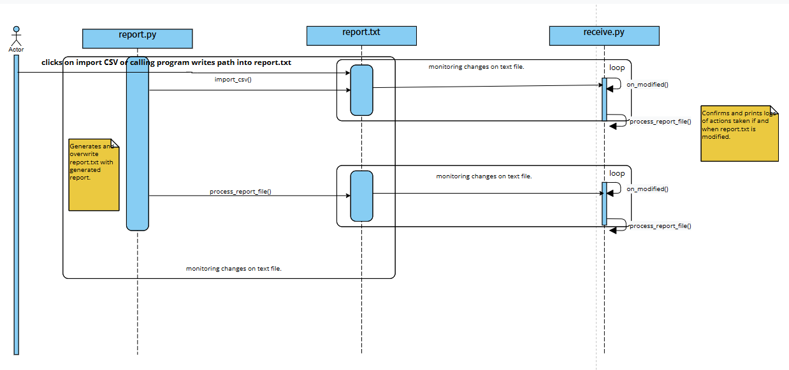
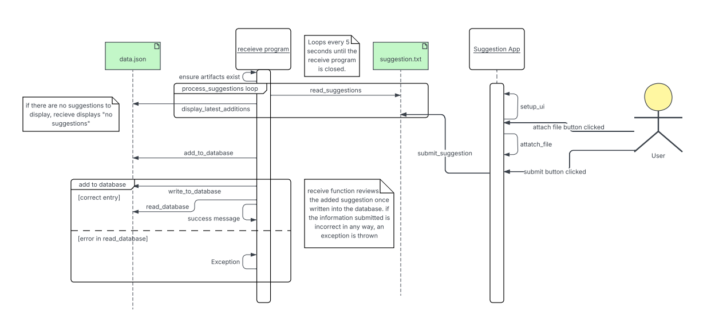

# Group 15 Microservices
## CSV Report Generator Microservice

### Installation

Install the required dependencies:
```bash
pip install pandas watchdog
```
or
```bash
pip install -r requirements.txt
```

### How to REQUEST Data (Submit CSV File)

#### Method 1: Direct File Path Writing

Write a CSV file path directly to `report.txt`. The GUI will automatically detect this and generate a report.

```python
# write file path to report.txt
with open('report.txt', 'w') as f:
    f.write("/path/to/your/data.csv")
```

#### Method 2: Command Line Request

```bash
# write file path to report.txt
echo "/path/to/your/data.csv" > report.txt
```

### How to RECEIVE Data (Access Report)

#### Starting the Receiver Service

1. Run both services (order doesn't matter):
   ```bash
   python receive.py
   python report.py
   ```

2. The services will:
   - Start monitoring `report.txt` for a path to a CSV file
   - Displays real-time updates in the console and `report.txt`

#### Example Data

```
Dataset Summary Report
==================================================

File: sample data(Sheet1).csv

Data Preview (first 5 rows):
   ID           Name  Age
0   1       John Doe   32
1   2     Jane Smith   28
2   3    Bob Johnson   45
3   4    Alice Brown   29
4   5  Carlie Wilson   35
============================================================
```

### UML Sequence Diagram


## Login Microservice

### Installation

Install the required dependencies:
    pip install fastapi uvicorn pydantic

### How to REQUEST Data (Authenticate a login with the user's credentials)
Send a POST request with a JSON body containing the user's credentials.

    credentials = {
        "username": "Thayer",
        "password": "12345678"
    }

    response = requests.post(
        "http://localhost:8000/login",
        json=credentials
    )

    print(response.json())

### How to RECEIVE Data (Process and Access User Credentials)

Receives login data through a POST request. FastAPI
converts the incoming JSON into a Pydantic model, making
the values easy to access and validate.

    class LoginRequest(BaseModel):
        username: str
        password: str

    @app.post("/login")
    def login_user(data: LoginRequest):
        # Access fields with data.username and data.password
        if data.username != "Thayer" or data.password != "12345678":
            raise HTTPException(status_code=401, detail="Invalid credentials")
        return {"message": f"Welcome {data.username}!"}

## Suggestion Microservice

### How to REQUEST Data (Submit Suggestions)
You can submit suggestions programmatically by writing directly to the `suggestion.txt` file:

```python
import json
from datetime import datetime

# example programmatic submission
suggestion_data = {
    "suggestion": "Add user profile customization features",
    "timestamp": datetime.now().isoformat(),
    "has_attachment": False,
    "attachment_path": None
}

with open("suggestion.txt", "a", encoding="utf-8") as f:
    f.write(json.dumps(suggestion_data) + "\n")
```

Supported file attachments:
- **Images**: JPG, JPEG, PNG
- **Documents**: PDF, DOC, DOCX, TXT

### How to RECEIVE Data (Process and Access Suggestions)

#### Starting the Receiver Service

1. Run the receiver service (run this first before suggestion.py):
   ```bash
   python receive.py
   ```

2. The service will:
   - Start monitoring `suggestion.txt` for new submissions
   - Process suggestions into the database (`data.json`)
   - Display real-time updates in the console

#### Accessing Processed Data

##### Method 1: Real-time Console Output

The receiver service provides continuous updates:

```
==================================================
latest suggestions in database
==================================================
🟢 id: 3 | status: new      | date: 2024-01-15T14:30:45
   suggestion: We should add dark mode to the application...
   📎 attachment: /path/to/screenshot.png
--------------------------------------------------
```

##### Method 2: Direct Database Access

Read directly from `data.json`:

```python
import json

# example call to read all suggestions
with open('data.json', 'r', encoding='utf-8') as f:
    suggestions_data = json.load(f)

# access specific suggestion properties
for suggestion in suggestions_data:
    print(f"ID: {suggestion['id']}")
    print(f"Status: {suggestion['status']}")
    print(f"Suggestion: {suggestion['suggestion']}")
    print(f"Date Added: {suggestion['date_added']}")
    print(f"Has Attachment: {suggestion['has_attachment']}")
```

### Data Structure

Each suggestion in `data.json` contains:

```json
{
  "id": 1,
  "suggestion": "User's suggestion text",
  "date_added": "2024-01-15T14:30:45.123456",
  "status": "new",
  "has_attachment": false,
  "attachment_path": null,
  "submission_timestamp": "2024-01-15T14:30:45.123456"
}
```

### UML Sequence Diagram
